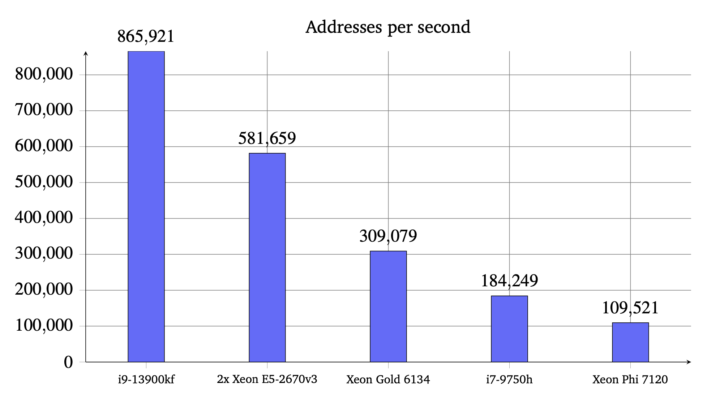
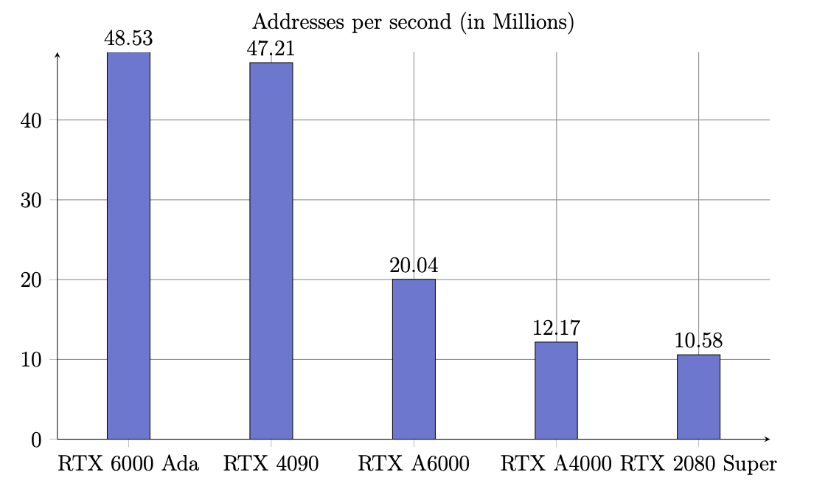

# eth-search
Search for wallets in eth blockchain.

This repo is a part of my thesis on security of cryptocurrency wallets. It generates random/sequential Ethereum addresses and searches for them against list of known used addresses extracted from Google BigQuery.

It consists of two implemenations:
1. C code which should run on every system with dynamic memory allocation and sufficient memory (around 8GB).
2. CUDA code which should run on NVIDIA GPUs with compute capability 7.5 or higher.

## How it works
1. Load address list from `addresses.csv` file (each line is one address hashed in xxhash64).
2. Parallel region or cuda kernel is started.
3. Generate random/sequential private key.
4. Generate public key.
5. Generate address.
6. Check if address is in the list.
7. If address is found, print it and its private key.
8. Repeat from step 3 until all addresses in predefined range are checked.

## How to run

### C code
1. Dependencies: [`secp256k1`](https://github.com/bitcoin-core/secp256k1), [`sha3`](https://github.com/brainhub/SHA3IUF), [`xxhash`](https://github.com/Cyan4973/xxHash) are required.
2. Compile the code using `gcc -o main main.c hashset.c -lsecp256k1 -lsha3 -lxxhash -fopenmp`.
3. Provide the number of threads and the number of addresses to search in the code.
4. Provide list of known addresses in `addresses.csv` file. Each line should contain one address in xxhash64 format.

### CUDA code
1. Dependencies: `cuCollections`, `thrust`, `hashcat`, `keccak256` are required.
2. Compile the code using `make` (cuCollections requires it alongside CPM).
3. Provide list of known addresses in `addresses.csv` file. Each line should contain one address in xxhash64 format.

## Results

